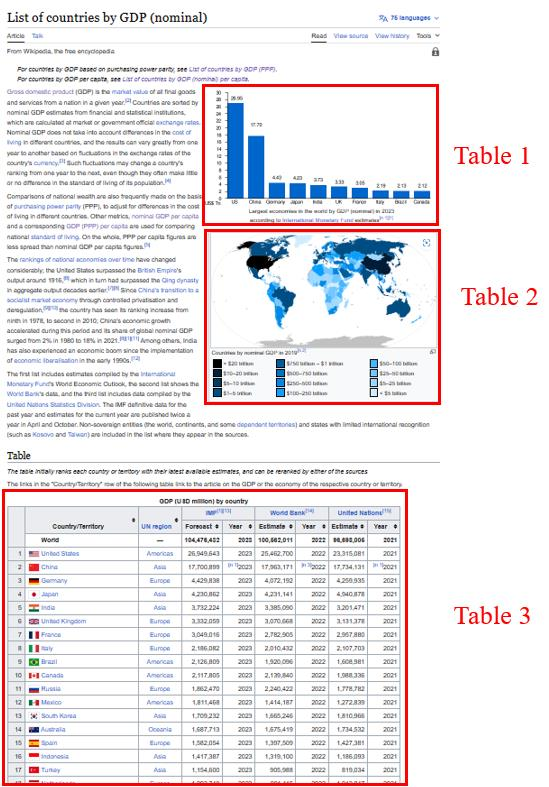

In this practice project, I will extract data from a website using webscraping and reqeust APIs process it using Pandas and Numpy libraries.

Step 1:
Extract the required GDP data from the given URL using Web Scraping.

Step 2:
Modify the GDP column of the DataFrame, converting the value available in Million USD to Billion USD.

Step 3:
Load the DataFrame to the CSV file named "Largest_economies.csv"

